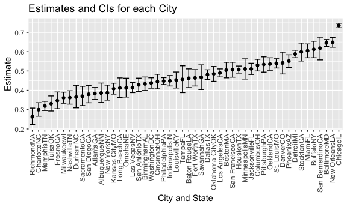
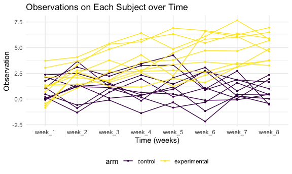

Homework 5
================

``` r
library(tidyverse)


knitr::opts_chunk$set(
  fig.width = 6, 
  fig.asp = .6,
  out.width = "90%")

theme_set(theme_minimal() + theme(legend.position = "bottom"))

options(
  ggplot2.continuous.colour = "viridis",
  ggplot2.continuous.fill = "viridis"
)

scale_colour_discrete = scale_colour_viridis_d
scale_fill_discrete = scale_fill_viridis_d
```

## Problem 1

``` r
# Load dataset
homicide = 
  read_csv("./data/homicide-data.csv", na = c("", "Unknown")) %>% 
  mutate(
    city_state = str_c(city, state), 
    resolution = case_when(
      disposition == "Closed without arrest" ~ "unsolved", 
      disposition == "Open/No arrest" ~ "unsolved", 
      disposition == "Closed by arrest" ~ "solved"
    )) %>% 
  relocate(city_state) %>% 
  filter(city_state != "TulsaAL")
```

    ## Rows: 52179 Columns: 12

    ## ── Column specification ────────────────────────────────────────────────────────
    ## Delimiter: ","
    ## chr (8): uid, victim_last, victim_first, victim_race, victim_sex, city, stat...
    ## dbl (4): reported_date, victim_age, lat, lon

    ## 
    ## ℹ Use `spec()` to retrieve the full column specification for this data.
    ## ℹ Specify the column types or set `show_col_types = FALSE` to quiet this message.

#### Summarize within cities to obtain the total number of homicides and the number of unsolved homicides

``` r
# the total number of homicides
homicide %>% 
  count(city_state)
```

    ## # A tibble: 50 × 2
    ##    city_state        n
    ##    <chr>         <int>
    ##  1 AlbuquerqueNM   378
    ##  2 AtlantaGA       973
    ##  3 BaltimoreMD    2827
    ##  4 Baton RougeLA   424
    ##  5 BirminghamAL    800
    ##  6 BostonMA        614
    ##  7 BuffaloNY       521
    ##  8 CharlotteNC     687
    ##  9 ChicagoIL      5535
    ## 10 CincinnatiOH    694
    ## # … with 40 more rows

``` r
# the number of unsolved homicides
homicide %>%  
  filter(resolution == "unsolved") %>% 
  count(city_state)
```

    ## # A tibble: 50 × 2
    ##    city_state        n
    ##    <chr>         <int>
    ##  1 AlbuquerqueNM   146
    ##  2 AtlantaGA       373
    ##  3 BaltimoreMD    1825
    ##  4 Baton RougeLA   196
    ##  5 BirminghamAL    347
    ##  6 BostonMA        310
    ##  7 BuffaloNY       319
    ##  8 CharlotteNC     206
    ##  9 ChicagoIL      4073
    ## 10 CincinnatiOH    309
    ## # … with 40 more rows

#### Estimate the proportion of homicides and confidence intervals that are unsolved

Focus on Baltimore, MD

``` r
baltimore_df = 
  homicide %>% 
  filter(city_state == "BaltimoreMD")

# estimate the proportion of homicides that are unsolved
baltimore_summary = 
  baltimore_df %>% 
  summarize(
    unsolved = sum(resolution == "unsolved"), 
    n = n()
  )

baltimore_test = 
  prop.test(
  x = baltimore_summary %>% pull(unsolved), 
  n = baltimore_summary %>%  pull(n)
)

baltimore_test %>% 
  broom::tidy()
```

    ## # A tibble: 1 × 8
    ##   estimate statistic  p.value parameter conf.low conf.high method    alternative
    ##      <dbl>     <dbl>    <dbl>     <int>    <dbl>     <dbl> <chr>     <chr>      
    ## 1    0.646      239. 6.46e-54         1    0.628     0.663 1-sample… two.sided

Iterate across cities

``` r
# write a function
prop_test_function = function(city_df){
  city_summary = 
  city_df %>% 
  summarize(
    unsolved = sum(resolution == "unsolved"), 
    n = n()
  )

city_test = 
  prop.test(
  x = city_summary %>% pull(unsolved), 
  n = city_summary %>%  pull(n)
)
  return(city_test)
}
```

``` r
# iterate the pro_test_function across cities by nesting dataframes together
results_df = 
  homicide %>% 
  nest(data = uid:resolution) %>% 
  mutate(
    test_results = map(data, prop_test_function), 
    tidy_results = map(test_results, broom::tidy)
  ) %>% 
  select(city_state, tidy_results) %>% 
  unnest(tidy_results) %>% 
  select(city_state, estimate, starts_with("conf"))
```

#### Create a plot that shows the estimates and CIs for each city

``` r
results_df %>% 
  mutate(city_state = fct_reorder(city_state, estimate)) %>% 
  ggplot(aes(x = city_state, y = estimate)) +
    geom_point() +
    geom_errorbar(aes(ymin = conf.low, ymax = conf.high)) +
    theme(axis.text.x = element_text(angle = 90, vjust = 0.5, hjust = 1)) +
    labs(
      title = "Estimates and CIs for each City", 
      x = "City and State", 
      y = "Estimate"
    )
```



## Problem 2

#### Create a tidy dataframe containing data from all participants, including the subject ID, arm, and observations over time:

``` r
longitudinal = tibble(
  files = list.files("./data/problem2_data/")) %>% 
  mutate(data = map(.x = files, ~ read_csv(paste0("./data/problem2_data/", .x)))) %>% 
  unnest(cols = data) %>% 
  separate(files, into = c("arm", "subject_id"), sep = "\\_") %>% 
  mutate(
    subject_id = str_replace(subject_id, "\\.csv", ""), 
    subject_id = str_c(arm, subject_id, sep = "_"),
    arm = ifelse(arm == "con", "control", "experimental")) %>% 
  select(subject_id, everything())

knitr::kable(longitudinal)
```

| subject_id | arm          | week_1 | week_2 | week_3 | week_4 | week_5 | week_6 | week_7 | week_8 |
|:-----------|:-------------|-------:|-------:|-------:|-------:|-------:|-------:|-------:|-------:|
| con_01     | control      |   0.20 |  -1.31 |   0.66 |   1.96 |   0.23 |   1.09 |   0.05 |   1.94 |
| con_02     | control      |   1.13 |  -0.88 |   1.07 |   0.17 |  -0.83 |  -0.31 |   1.58 |   0.44 |
| con_03     | control      |   1.77 |   3.11 |   2.22 |   3.26 |   3.31 |   0.89 |   1.88 |   1.01 |
| con_04     | control      |   1.04 |   3.66 |   1.22 |   2.33 |   1.47 |   2.70 |   1.87 |   1.66 |
| con_05     | control      |   0.47 |  -0.58 |  -0.09 |  -1.37 |  -0.32 |  -2.17 |   0.45 |   0.48 |
| con_06     | control      |   2.37 |   2.50 |   1.59 |  -0.16 |   2.08 |   3.07 |   0.78 |   2.35 |
| con_07     | control      |   0.03 |   1.21 |   1.13 |   0.64 |   0.49 |  -0.12 |  -0.07 |   0.46 |
| con_08     | control      |  -0.08 |   1.42 |   0.09 |   0.36 |   1.18 |  -1.16 |   0.33 |  -0.44 |
| con_09     | control      |   0.08 |   1.24 |   1.44 |   0.41 |   0.95 |   2.75 |   0.30 |   0.03 |
| con_10     | control      |   2.14 |   1.15 |   2.52 |   3.44 |   4.26 |   0.97 |   2.73 |  -0.53 |
| exp_01     | experimental |   3.05 |   3.67 |   4.84 |   5.80 |   6.33 |   5.46 |   6.38 |   5.91 |
| exp_02     | experimental |  -0.84 |   2.63 |   1.64 |   2.58 |   1.24 |   2.32 |   3.11 |   3.78 |
| exp_03     | experimental |   2.15 |   2.08 |   1.82 |   2.84 |   3.36 |   3.61 |   3.37 |   3.74 |
| exp_04     | experimental |  -0.62 |   2.54 |   3.78 |   2.73 |   4.49 |   5.82 |   6.00 |   6.49 |
| exp_05     | experimental |   0.70 |   3.33 |   5.34 |   5.57 |   6.90 |   6.66 |   6.24 |   6.95 |
| exp_06     | experimental |   3.73 |   4.08 |   5.40 |   6.41 |   4.87 |   6.09 |   7.66 |   5.83 |
| exp_07     | experimental |   1.18 |   2.35 |   1.23 |   1.17 |   2.02 |   1.61 |   3.13 |   4.88 |
| exp_08     | experimental |   1.37 |   1.43 |   1.84 |   3.60 |   3.80 |   4.72 |   4.68 |   5.70 |
| exp_09     | experimental |  -0.40 |   1.08 |   2.66 |   2.70 |   2.80 |   2.64 |   3.51 |   3.27 |
| exp_10     | experimental |   1.09 |   2.80 |   2.80 |   4.30 |   2.25 |   6.57 |   6.09 |   4.64 |

#### Make a spaghetti plot showing observations on each subject over time:

``` r
plot = 
  longitudinal %>% 
  pivot_longer(
    cols = week_1:week_8,
    names_to = "time",
    values_to = "data"
  )

plot %>% 
  ggplot(aes(x = time, y = data, group = subject_id, color = arm)) +
  geom_point(size = 0.7) +
  geom_line() +
  labs(
    title = "Observations on Each Subject over Time", 
    x = "Time (weeks)", 
    y = "Observation"
  )
```



On week one, the observations from the control arm and experimental arm
do not show significant differences. Over time, the observations from
the control arm tend to be more stable, while the observations from the
experimental arm are steadily increasing. On week eight, all subjects in
the experimental arm have higher values of observations than all
subjects in the control arm.

## Problem 3

Loads the iris dataset:

``` r
set.seed(10)

iris_with_missing = iris %>% 
  map_df(~replace(.x, sample(1:150, 20), NA)) %>%
  mutate(Species = as.character(Species))
```

#### Write a function to fill in missing values

``` r
fill_in_missing = function(x){
  if(is.numeric(x)){
    replace(x, is.na(x), mean(x, na.rm = TRUE))
  }
  
  else if(is.character(x)){
    replace(x, is.na(x), "virginica")
  }
}

filled_iris = 
  iris_with_missing %>% 
  map_df(fill_in_missing) 
```
