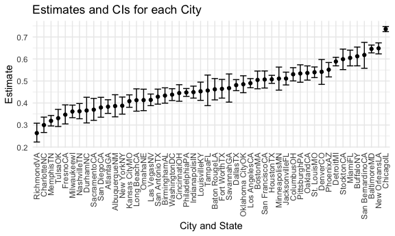

Homework 5
================

``` r
library(tidyverse)
```

    ## ── Attaching packages ─────────────────────────────────────── tidyverse 1.3.1 ──

    ## ✓ ggplot2 3.3.5     ✓ purrr   0.3.4
    ## ✓ tibble  3.1.4     ✓ dplyr   1.0.7
    ## ✓ tidyr   1.1.4     ✓ stringr 1.4.0
    ## ✓ readr   2.0.2     ✓ forcats 0.5.1

    ## ── Conflicts ────────────────────────────────────────── tidyverse_conflicts() ──
    ## x dplyr::filter() masks stats::filter()
    ## x dplyr::lag()    masks stats::lag()

``` r
knitr::opts_chunk$set(
  fig.width = 6, 
  fig.asp = .6,
  out.width = "90%")
```

# Problem 1

``` r
# Load dataset
homicide = 
  read_csv("./data/homicide-data.csv", na = c("", "Unknown")) %>% 
  mutate(
    city_state = str_c(city, state), 
    resolution = case_when(
      disposition == "Closed without arrest" ~ "unsolved", 
      disposition == "Open/No arrest" ~ "unsolved", 
      disposition == "Closed by arrest" ~ "solved"
    )) %>% 
  relocate(city_state) %>% 
  filter(city_state != "TulsaAL")
```

    ## Rows: 52179 Columns: 12

    ## ── Column specification ────────────────────────────────────────────────────────
    ## Delimiter: ","
    ## chr (8): uid, victim_last, victim_first, victim_race, victim_sex, city, stat...
    ## dbl (4): reported_date, victim_age, lat, lon

    ## 
    ## ℹ Use `spec()` to retrieve the full column specification for this data.
    ## ℹ Specify the column types or set `show_col_types = FALSE` to quiet this message.

``` r
# the total number of homicides
homicide %>% 
  count(city_state)
```

    ## # A tibble: 50 × 2
    ##    city_state        n
    ##    <chr>         <int>
    ##  1 AlbuquerqueNM   378
    ##  2 AtlantaGA       973
    ##  3 BaltimoreMD    2827
    ##  4 Baton RougeLA   424
    ##  5 BirminghamAL    800
    ##  6 BostonMA        614
    ##  7 BuffaloNY       521
    ##  8 CharlotteNC     687
    ##  9 ChicagoIL      5535
    ## 10 CincinnatiOH    694
    ## # … with 40 more rows

``` r
# the number of unsolved homicides
homicide %>%  
  filter(resolution == "unsolved") %>% 
  count(city_state)
```

    ## # A tibble: 50 × 2
    ##    city_state        n
    ##    <chr>         <int>
    ##  1 AlbuquerqueNM   146
    ##  2 AtlantaGA       373
    ##  3 BaltimoreMD    1825
    ##  4 Baton RougeLA   196
    ##  5 BirminghamAL    347
    ##  6 BostonMA        310
    ##  7 BuffaloNY       319
    ##  8 CharlotteNC     206
    ##  9 ChicagoIL      4073
    ## 10 CincinnatiOH    309
    ## # … with 40 more rows

Focus on Baltimore, MD

``` r
baltimore_df = 
  homicide %>% 
  filter(city_state == "BaltimoreMD")

# estimate the proportion of homicides that are unsolved
baltimore_summary = 
  baltimore_df %>% 
  summarize(
    unsolved = sum(resolution == "unsolved"), 
    n = n()
  )

baltimore_test = 
  prop.test(
  x = baltimore_summary %>% pull(unsolved), 
  n = baltimore_summary %>%  pull(n)
)

baltimore_test %>% 
  broom::tidy()
```

    ## # A tibble: 1 × 8
    ##   estimate statistic  p.value parameter conf.low conf.high method    alternative
    ##      <dbl>     <dbl>    <dbl>     <int>    <dbl>     <dbl> <chr>     <chr>      
    ## 1    0.646      239. 6.46e-54         1    0.628     0.663 1-sample… two.sided

Iterate across cities

``` r
# write a function
prop_test_function = function(city_df){
  city_summary = 
  city_df %>% 
  summarize(
    unsolved = sum(resolution == "unsolved"), 
    n = n()
  )

city_test = 
  prop.test(
  x = city_summary %>% pull(unsolved), 
  n = city_summary %>%  pull(n)
)
  return(city_test)
}
```

``` r
# iterate the pro_test_function across cities by nesting dataframes together
results_df = 
  homicide %>% 
  nest(data = uid:resolution) %>% 
  mutate(
    test_results = map(data, prop_test_function), 
    tidy_results = map(test_results, broom::tidy)
  ) %>% 
  select(city_state, tidy_results) %>% 
  unnest(tidy_results) %>% 
  select(city_state, estimate, starts_with("conf"))
```

``` r
results_df %>% 
  mutate(city_state = fct_reorder(city_state, estimate)) %>% 
  ggplot(aes(x = city_state, y = estimate)) +
    geom_point() +
    geom_errorbar(aes(ymin = conf.low, ymax = conf.high)) +
    theme(axis.text.x = element_text(angle = 90, vjust = 0.5, hjust = 1)) +
    labs(
      title = "Estimates and CIs for each City", 
      x = "City and State", 
      y = "Estimate"
    )
```


